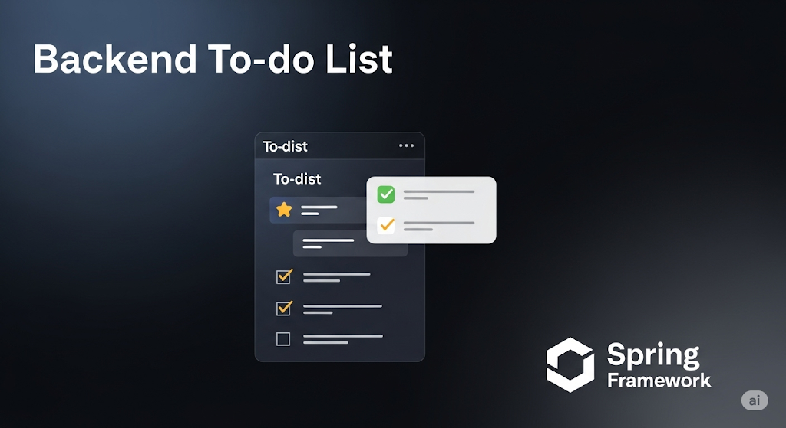

# 📝 ToDoList API

<p align="center">
  
</p>

<p align="center">
    A robust and modern RESTful API for managing tasks, built with Spring Boot and following clean architecture principles.
</p>

--- 

Domain-Driven Design (DDD) is a strategic approach to software development focused on modeling the business domain
and its complexities. This project leverages DDD to create a clean, maintainable architecture where the core domain 
logic is encapsulated in the domain layer, ensuring that business rules are the primary focus. By aligning code with 
real-world business processes, DDD facilitates improved collaboration between developers and domain experts, promotes 
a shared understanding of the domain, and results in a more adaptable and testable system. This approach enhances 
the clarity and robustness of the application, making it easier to manage and evolve as business needs change.

## 🚀 Features

- ✅ Create, read, update, and delete tasks
- ✅ Toggle task completion status
- ✅ Input validation
- ✅ Custom exception handling
- ✅ Clean architecture implementation
- ✅ JPA/Hibernate with H2 database

## 🛠️ Tech Stack

- **Java 17**
- **Spring Boot**
- **Maven**
- **JUnit** (for testing)

## 🏗️ Project Structure

```
src/main/java/com/uninter/todolist/todolist/
├── common/                       # Common utilities and shared code
│   └── domain/exception/         # Base exceptions
│   └── interfaces/exception/     # Global exception handling
│
├── todo/                       # Todo module
│   ├── application/              # Application services and DTOs
│   │   └── dto/                  # Data Transfer Objects
│   │
│   ├── domain/                   # Domain layer
│   │   ├── exceptions/           # Domain-specific exceptions
│   │   ├── model/                # Domain models
│   │   └── repository/           # Repository interfaces
│   │
│   ├── infrastructure/           # Infrastructure layer
│   │   └── persistence/          # JPA entities and repositories
│   │
│   └── interfaces/               # Interface layer
│       └── rest/                 # REST controllers
│
└── TodolistApplication.java      # Main application class
```

## 📚 API Endpoints

### Tasks

- `GET /todos` - List all tasks
- `GET /todos/{id}` - Get a specific task by ID
- `POST /todos` - Create a new task
  ```json
  {
    "nome": "Task name",
    "responsavel": "Responsible person",
    "dataEntrega": "2025-12-31T23:59:59"
  }
  ```
- `PUT /todos/{id}` - Update a task
  ```json
  {
    "nome": "Updated task name",
    "responsavel": "Updated responsible",
    "dataEntrega": "2025-12-31T23:59:59",
    "finalizado": false
  }
  ```
- `DELETE /todos/{id}` - Delete a task
- `POST /todos/{id}/toggle-status` - Toggle task completion status

## 🚨 Exceptions

### `ResourceNotFoundException` (HTTP 404)
Thrown when a requested resource is not found.

**Example:**
```json
{
  "timestamp": "2025-06-25T02:49:51.123456",
  "error_code": "resource_not_found",
  "message": "Todo não encontrado com o ID: 123e4567-e89b-12d3-a456-426614174000"
}
```

### `ValidationException` (HTTP 400)
Thrown when request validation fails.

**Example:**
```json
{
  "nome": "Nome não pode ser vazio",
  "responsavel": "Responsável não pode ser vazio",
  "dataEntrega": "Data de entrega é obrigatória"
}
```

## 🚀 Getting Started

1. **Prerequisites**
   - Java 17 or higher
   - Maven 3.6.3 or higher

2. **Running the application**
   ```bash
   mvn spring-boot:run
   ```

## 🧪 Testing

Run the tests with:
```bash
mvn test
```

## 🧩 Dependencies

- Spring Boot Starter Web
- Spring Boot Starter Data JPA
- H2 Database
- Lombok
- Spring Boot Starter Validation
- Spring Boot Starter Test

## 📝 License

This project is licensed under the MIT License - see the [LICENSE](LICENSE) file for details.

---

Made with ❤️ by **Ryan Guimarães** | [GitHub](https://github.com/guimaraesr-y)
